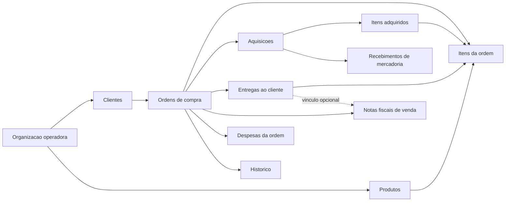

# Regras de negocio v2 - Ordens de compra

## Status deste documento

Este documento define a direcao funcional aprovada para a reformulacao do
Fincheck. Ele descreve o novo MVP, mas **nao representa funcionalidades ja
implementadas**.

As regras foram consolidadas a partir do processo real da empresa e da analise
visual de tres ordens de compra emitidas por clientes distintos.

## 1. Objetivo do produto

O novo Fincheck sera um sistema de gestao operacional e financeira de ordens de
compra recebidas de hospitais, faculdades e outros clientes.

O fluxo central e:

```text
Ordem do cliente
  -> aquisicoes dos produtos
  -> recebimento dos produtos
  -> entrega parcial ou total ao cliente
  -> faturamento
  -> recebimento do pagamento
  -> apuracao da margem
```

O sistema nao sera, no MVP, um ERP completo, um sistema contabil ou um controle
generico de estoque.

## 2. Contexto operacional

1. Um cliente publica uma cotacao.
2. A empresa participa da cotacao.
3. Quando a proposta e vencedora, o cliente emite uma ordem de compra.
4. A empresa compra os itens da ordem em marketplaces ou vendedores diversos.
5. As compras podem ser feitas por pessoas, cartoes e formas de pagamento
   diferentes.
6. Os produtos podem chegar em momentos diferentes.
7. O cliente pode receber uma entrega parcial antes da conclusao de toda a
   ordem.
8. Uma ou mais notas fiscais podem ser emitidas para a mesma ordem.
9. O faturamento e o recebimento do pagamento precisam ser acompanhados
   separadamente.
10. A margem operacional prevista e calculada com base na receita contratada,
    nos custos de aquisicao e nas demais despesas conhecidas.

## 3. Linguagem do dominio

Para evitar a ambiguidade da palavra "fornecedor", o produto usara os seguintes
termos:

- **Cliente ou comprador:** hospital, faculdade ou outra organizacao que emitiu
  a ordem de compra.
- **Nossa empresa ou organizacao operadora:** empresa que recebeu a ordem,
  compra os produtos e realiza a entrega. Nos PDFs dos clientes, ela normalmente
  aparece como "fornecedor".
- **Vendedor da aquisicao:** marketplace, distribuidor ou outro estabelecimento
  no qual nossa empresa comprou um produto.
- **Ordem de compra:** compromisso comercial emitido pelo cliente.
- **Item da ordem:** produto ou material solicitado em uma linha da ordem.
- **Aquisicao:** compra realizada por nossa empresa para atender uma unica ordem
  de compra.
- **Recebimento de mercadoria:** registro da chegada parcial ou total de uma
  aquisicao.
- **Entrega ao cliente:** envio parcial ou total dos itens ja recebidos.
- **Fatura ou nota fiscal de venda:** documento emitido contra o cliente.
- **Recebimento financeiro:** confirmacao de que o cliente pagou uma fatura.

## 4. Escopo do MVP

O MVP deve permitir:

- cadastrar e editar clientes;
- cadastrar, editar, inativar e consultar produtos;
- manter referencias do ultimo preco de compra, canal e ultimo preco de venda;
- cadastrar manualmente uma ordem de compra;
- cadastrar os itens e os valores comerciais da ordem;
- acompanhar o progresso de compra, chegada e entrega por item;
- registrar uma ou mais aquisicoes para a mesma ordem;
- vincular cada item adquirido ao item correspondente da ordem;
- registrar quem realizou a compra e como ela foi paga;
- registrar chegadas parciais ou totais;
- registrar entregas parciais ou totais ao cliente;
- registrar uma ou mais notas fiscais de venda;
- distinguir valor faturado de valor efetivamente recebido;
- registrar imposto, frete de entrega e outras despesas da ordem;
- exibir receita, custo conhecido, despesas e margem operacional prevista;
- manter um historico das principais alteracoes;
- funcionar de forma responsiva em desktop e celular.

## 5. Fora do MVP

Os seguintes recursos ficam explicitamente para etapas posteriores:

- leitura automatica de PDFs por OCR ou inteligencia artificial;
- importacao automatica de ordens de compra;
- armazenamento e gestao de anexos;
- estoque geral reutilizavel entre ordens;
- reserva, transferencia ou baixa de estoque;
- reaproveitamento automatico de produtos excedentes;
- integracoes com marketplaces, transportadoras ou ERPs de clientes;
- conciliacao bancaria e contabilidade completa;
- fluxo detalhado de contas a pagar das aquisicoes;
- pagamentos parciais dentro da mesma nota fiscal;
- devolucoes, avarias e trocas;
- permissoes avancadas por papel;
- relatorios analiticos avancados.

## 6. Premissas adotadas para o MVP

Estas premissas reduzem a complexidade inicial sem impedir evolucoes futuras:

- A `Entity` atual sera reaproveitada tecnicamente como a organizacao operadora,
  mas a experiencia inicial nao priorizara alternancia entre contas PF e PJ.
- Cada CNPJ ou unidade compradora sera tratado como um cliente independente. O
  agrupamento de filiais em uma rede podera ser adicionado depois.
- Todos os usuarios autenticados da organizacao poderao operar o modulo. O
  sistema registrara quem criou ou alterou cada informacao.
- Cada item novo de uma ordem deve selecionar um produto ativo do catalogo.
- O item preserva um snapshot dos dados do produto para que alteracoes futuras
  no catalogo nao modifiquem documentos antigos.
- Uma aquisicao pertence a exatamente uma ordem de compra.
- Uma aquisicao pode conter varios itens, desde que todos sejam da mesma ordem.
- Se uma compra real atender mais de uma ordem, ela devera ser dividida em
  registros internos separados por ordem.
- Pode ser comprada uma quantidade maior que a solicitada. O excedente sera
  apenas informativo no MVP.
- Uma ordem pode ter varias entregas e varias notas fiscais.
- Uma nota fiscal sera recebida integralmente ou permanecera pendente. Quando
  houver recebimentos parciais, serao registrados documentos separados no MVP.

## 7. Visao do dominio



## 8. Modelo funcional

### 8.1 Organizacao operadora

Representa a empresa que utiliza o sistema.

Dados minimos:

- razao social;
- nome fantasia;
- CNPJ;
- dados de contato;
- usuarios vinculados.

No primeiro ciclo de implementacao, o modelo existente de `Entity` podera ser
adaptado, evitando uma migracao desnecessaria de autenticacao e isolamento de
dados.

### 8.2 Cliente

Representa a unidade que emite a ordem de compra.

Dados minimos:

- razao social;
- nome fantasia;
- CNPJ ou outro documento;
- e-mail e telefone;
- endereco principal de faturamento;
- endereco principal de entrega;
- observacoes;
- situacao ativa ou inativa.

Os dados da ordem devem manter uma copia dos enderecos usados naquele momento.
Alterar o cadastro do cliente nao deve modificar ordens antigas.

### 8.3 Ordem de compra

Representa o documento comercial recebido do cliente.

Dados minimos:

- organizacao operadora;
- cliente;
- numero da ordem;
- numero externo adicional, quando houver;
- numero da cotacao, quando houver;
- numero da requisicao, quando houver;
- data de emissao;
- prazo de entrega solicitado;
- valor oficial da ordem;
- condicao de pagamento em texto livre;
- instrucoes e observacoes;
- dados de faturamento copiados do documento;
- dados de entrega copiados do documento;
- situacao de ciclo de vida;
- responsaveis pela criacao e ultima alteracao;
- datas de criacao e alteracao.

O numero da ordem deve ser unico dentro da combinacao organizacao e cliente.

Situacoes persistidas de ciclo de vida:

- `DRAFT`: cadastro ainda incompleto;
- `ACTIVE`: ordem valida e em operacao;
- `CANCELLED`: ordem cancelada.

O progresso operacional nao deve ser digitado manualmente. Ele sera derivado
das quantidades dos itens.

### 8.4 Produto

Representa um item reutilizavel do catalogo da organizacao.

Dados do MVP:

- nome;
- marca, com `Outros` quando nao houver;
- especificacao, opcional;
- embalagem ou apresentacao, como unidade, caixa, kit ou pacote;
- unidade normalizada para calculos;
- ultimo preco de compra, opcional;
- marketplace ou fornecedor da ultima compra, opcional;
- ultimo preco de venda, opcional;
- situacao ativa ou inativa.

Uma ordem ativa atualiza a referencia de venda. Uma aquisicao nao cancelada
atualiza a referencia de compra e seu canal, desde que seja o evento mais
recente conhecido. Produtos usados no historico devem ser inativados, nao
excluidos.

### 8.5 Item da ordem

Cada linha do documento referencia um produto e preserva um retrato comercial
dos dados usados no momento da venda.

Dados do MVP:

- ordem de compra;
- produto do catalogo;
- numero ou sequencia da linha;
- descricao livre;
- marca;
- especificacao, opcional;
- unidade original exibida no documento;
- unidade normalizada para calculos;
- quantidade solicitada;
- preco unitario de venda;
- valor total oficial da linha;
- observacoes, opcionais.

Precisao recomendada:

- quantidade: `numeric(14,3)`;
- preco unitario: `numeric(16,6)`;
- totais monetarios: `numeric(16,2)`.

O valor oficial informado pelo cliente sera preservado, mesmo quando houver uma
pequena diferenca em relacao ao valor recalculado pelo sistema.

### 8.6 Aquisicao

Representa uma compra feita para atender uma ordem.

Dados minimos:

- ordem de compra;
- nome e documento do vendedor da aquisicao, quando disponiveis;
- marketplace ou canal;
- numero do pedido no vendedor;
- data da compra;
- responsavel pela compra;
- forma de pagamento;
- identificacao segura do cartao ou meio de pagamento;
- titular do pagamento;
- frete de compra;
- desconto geral;
- outras despesas de compra;
- situacao;
- observacoes.

O sistema nunca deve armazenar numero completo do cartao, codigo de seguranca ou
qualquer credencial de pagamento. Uma identificacao como "Visa final 1234 -
Felipe" e suficiente.

Situacoes:

- `PLACED`: compra realizada;
- `IN_TRANSIT`: envio em transporte;
- `PARTIALLY_RECEIVED`: parte dos itens chegou;
- `RECEIVED`: todos os itens adquiridos chegaram;
- `CANCELLED`: aquisicao cancelada.

As situacoes parcial e recebida devem ser derivadas dos recebimentos registrados.

### 8.7 Item adquirido

Vincula uma linha da aquisicao a um item da ordem.

Dados minimos:

- aquisicao;
- item da ordem;
- quantidade adquirida;
- preco unitario de custo;
- desconto da linha;
- valor total de custo;
- observacoes.

Um item da ordem pode ser atendido por varias aquisicoes. Uma aquisicao pode
atender varios itens da mesma ordem.

### 8.8 Recebimento de mercadoria

Registra uma chegada fisica, inclusive parcial.

Cabecalho:

- aquisicao;
- data do recebimento;
- pessoa que conferiu;
- situacao;
- observacoes.

Linhas:

- item adquirido;
- quantidade recebida.

Uma aquisicao pode ter varios recebimentos.

Situacoes:

- `COMPLETED`: recebimento confirmado;
- `CANCELLED`: recebimento invalidado, mas preservado no historico.

Somente recebimentos concluidos afetam as quantidades recebidas.

### 8.9 Entrega ao cliente

Registra o que foi efetivamente entregue ao cliente.

Cabecalho:

- ordem de compra;
- situacao;
- data da saida, quando houver;
- data da entrega, quando houver;
- custo de frete opcional, com zero para entrega propria;
- observacoes.

Destinatario e rastreio nao fazem parte do MVP, pois a operacao normalmente
realiza a entrega diretamente ao cliente.

Linhas:

- item da ordem;
- quantidade entregue.

Situacoes:

- `PREPARING`: entrega em preparacao;
- `DISPATCHED`: entrega em deslocamento;
- `DELIVERED`: entrega confirmada;
- `CANCELLED`: entrega cancelada.

Somente entregas concluidas afetam as quantidades entregues.

### 8.10 Nota fiscal de venda

Registra o faturamento e o recebimento financeiro.

Dados minimos:

- ordem de compra;
- entrega relacionada, opcional;
- numero da nota;
- data de emissao;
- valor;
- data de vencimento;
- situacao;
- data de recebimento, quando paga;
- observacoes.

Situacoes persistidas:

- `ISSUED`: emitida e ainda nao recebida;
- `RECEIVED`: pagamento recebido;
- `CANCELLED`: documento cancelado.

`OVERDUE` sera uma condicao derivada quando a nota estiver emitida, nao recebida
e com vencimento anterior a data atual.

Emitir uma nota fiscal nao significa que o dinheiro foi recebido.

### 8.11 Despesa da ordem

Registra custos operacionais que nao fazem parte diretamente dos itens
adquiridos.

Tipos iniciais:

- `TAX`: imposto da venda;
- `OUTBOUND_FREIGHT`: frete de entrega ao cliente;
- `OTHER`: outra despesa identificada.

Dados minimos:

- ordem de compra;
- tipo;
- descricao;
- valor;
- data de competencia;
- responsavel pelo registro.

### 8.12 Historico

O historico deve registrar ao menos:

- criacao e ativacao da ordem;
- alteracoes relevantes nos itens;
- aquisicoes e cancelamentos;
- recebimentos de mercadoria;
- entregas e cancelamentos;
- emissao, recebimento e cancelamento de notas;
- despesas adicionadas ou removidas.

Cada evento deve guardar data, usuario, tipo do evento e identificador do
registro afetado.

## 9. Quantidades e progresso operacional

Para cada item da ordem:

- `orderedQuantity`: quantidade solicitada pelo cliente;
- `acquiredQuantity`: soma das aquisicoes nao canceladas;
- `receivedQuantity`: soma dos recebimentos validos;
- `deliveredQuantity`: soma das entregas concluidas;
- `purchasePendingQuantity = max(orderedQuantity - acquiredQuantity, 0)`;
- `arrivalPendingQuantity = max(acquiredQuantity - receivedQuantity, 0)`;
- `deliveryPendingQuantity = max(orderedQuantity - deliveredQuantity, 0)`;
- `availableToDeliverQuantity = max(receivedQuantity - deliveredQuantity, 0)`;
- `excessQuantity = max(acquiredQuantity - orderedQuantity, 0)`.

O rotulo exibido para um item sera derivado, com a seguinte prioridade:

1. `DELIVERED`: toda a quantidade solicitada foi entregue.
2. `PARTIALLY_DELIVERED`: uma parte foi entregue.
3. `READY_FOR_DELIVERY`: ha quantidade recebida suficiente para concluir a
   entrega.
4. `PARTIALLY_RECEIVED`: parte da quantidade adquirida chegou.
5. `PURCHASED_AWAITING_ARRIVAL`: toda a quantidade solicitada foi comprada, mas
   ainda nao esta disponivel para entrega.
6. `PARTIALLY_PURCHASED`: apenas parte da quantidade solicitada foi comprada.
7. `PENDING_PURCHASE`: nenhuma quantidade foi comprada.

O progresso geral da ordem sera derivado pela agregacao de seus itens:

- `PENDING_PURCHASE`;
- `PARTIALLY_PURCHASED`;
- `PURCHASED`;
- `PARTIALLY_RECEIVED`;
- `READY_FOR_DELIVERY`;
- `PARTIALLY_DELIVERED`;
- `DELIVERED`.

`DRAFT` e `CANCELLED` sempre prevalecem sobre o progresso calculado.

## 10. Regras e invariantes

### 10.1 Isolamento

- Todo registro pertence a uma organizacao operadora.
- Todo acesso deve validar o usuario e a organizacao.
- Identificadores relacionados tambem devem pertencer a mesma organizacao.
- O `organizationId` enviado pelo cliente nao deve ser aceito sem validacao de
  vinculo com o usuario autenticado.

### 10.2 Ordem

- Uma ordem ativa deve possuir pelo menos um item.
- Quantidades solicitadas devem ser maiores que zero.
- Valores monetarios nao podem ser negativos.
- Ordens canceladas nao aceitam novos eventos operacionais.
- O valor oficial da ordem e a soma calculada dos itens devem ser armazenados
  separadamente.
- Divergencias entre o valor oficial e a soma dos itens geram um alerta, nao um
  bloqueio.

### 10.3 Aquisicao e recebimento

- Uma aquisicao pertence a exatamente uma ordem.
- Todos os itens adquiridos devem pertencer a essa mesma ordem.
- A quantidade adquirida pode superar a quantidade solicitada.
- O excedente nao fica automaticamente disponivel para outras ordens.
- A quantidade recebida nao pode superar a quantidade adquirida.
- Aquisicoes canceladas nao entram nos calculos de quantidade ou custo.
- Uma aquisicao com recebimentos validos nao pode ser cancelada antes do
  cancelamento desses recebimentos.
- Um recebimento nao pode ser cancelado se isso fizer a quantidade entregue
  superar a nova quantidade recebida valida.

### 10.4 Entrega

- A quantidade entregue nao pode superar a quantidade recebida e ainda
  disponivel.
- A quantidade entregue nao pode superar a quantidade solicitada na ordem.
- Uma entrega em rascunho nao altera o progresso.
- Concluir ou cancelar uma entrega deve ser uma operacao transacional.

### 10.5 Faturamento

- Uma ordem pode ter varias notas fiscais.
- Uma nota cancelada nao entra em valores faturados ou recebidos.
- Uma nota so pode ser marcada como recebida com uma data de recebimento.
- O valor recebido no MVP corresponde ao valor integral da nota.

### 10.6 Consistencia tecnica

- Operacoes que alterem varios registros devem usar transacao de banco.
- Comandos sujeitos a repeticao devem aceitar uma chave de idempotencia.
- Exclusoes de eventos financeiros ou operacionais devem ser evitadas; quando
  possivel, o registro deve ser cancelado e preservado no historico.

## 11. Visao financeira

O MVP apresentara uma margem operacional, nao um demonstrativo contabil.

Calculos por ordem:

```text
contractedRevenue = valor oficial da ordem

billedRevenue = soma das notas emitidas e nao canceladas

receivedRevenue = soma das notas marcadas como recebidas

acquisitionItemCost =
  quantidade adquirida * preco unitario de custo
  - desconto da linha

knownAcquisitionCost =
  soma dos acquisitionItemCost de aquisicoes nao canceladas
  + fretes de compra
  + outras despesas de compra
  - descontos gerais de compra

operatingExpenses =
  impostos
  + fretes de entrega
  + outras despesas da ordem

projectedMargin =
  contractedRevenue
  - knownAcquisitionCost
  - operatingExpenses

projectedMarginPercentage =
  projectedMargin / contractedRevenue * 100

unbilledRevenue =
  max(contractedRevenue - billedRevenue, 0)

accountsReceivable =
  max(billedRevenue - receivedRevenue, 0)
```

Registrar uma aquisicao torna seu valor um custo conhecido, mesmo quando a
compra foi feita no credito. Fluxo de caixa por vencimento da compra fica fora
do MVP.

## 12. Fluxos principais

### 12.1 Cadastrar uma ordem

1. Selecionar ou criar o cliente.
2. Informar os identificadores e dados comerciais da ordem.
3. Selecionar um produto em cada item ou cadastra-lo sem sair da ordem.
4. Conferir o valor oficial e a soma calculada.
5. Salvar como rascunho ou ativar.

### 12.2 Registrar uma compra

1. Abrir a ordem.
2. Criar uma aquisicao.
3. Informar vendedor, responsavel e forma de pagamento.
4. Selecionar os itens atendidos e suas quantidades.
5. Informar custos e concluir o registro.

### 12.3 Registrar uma chegada

1. Abrir a aquisicao.
2. Informar a data.
3. Informar quanto chegou de cada item.
4. Confirmar o recebimento.
5. Recalcular disponibilidade e progresso.

### 12.4 Realizar uma entrega parcial ou total

1. Abrir a ordem.
2. Criar uma entrega com base nos itens disponiveis.
3. Informar as quantidades.
4. Informar o frete somente quando houver transportadora ou outro custo.
5. Concluir a entrega.
6. Opcionalmente, registrar a nota fiscal relacionada.

### 12.5 Faturar e receber

1. Registrar numero, emissao, valor e vencimento da nota.
2. Acompanhar a nota como emitida, vencida ou recebida.
3. Ao receber o pagamento, informar a data e confirmar.
4. Atualizar os resumos faturado, a receber e recebido.

## 13. Experiencia no Web

### 13.1 Lista de ordens

Deve oferecer:

- busca por numero, cliente ou descricao de item;
- filtros por progresso, prazo de entrega e situacao financeira;
- indicadores de compra, chegada e entrega;
- valor contratado e margem prevista;
- destaque para ordens atrasadas ou com notas vencidas;
- acao clara para criar uma ordem.

### 13.2 Detalhe da ordem

Sera o centro operacional do produto e deve reunir:

- resumo comercial;
- progresso por item;
- aquisicoes;
- chegadas;
- entregas;
- notas fiscais e recebimentos;
- custos, despesas e margem;
- historico.

As acoes principais devem ficar proximas do contexto, por exemplo "Registrar
compra" ao lado dos itens pendentes e "Criar entrega" quando houver quantidade
disponivel.

### 13.3 Dashboard inicial

O dashboard deve priorizar:

- ordens abertas;
- itens ainda nao comprados;
- compras aguardando chegada;
- itens prontos para entrega;
- entregas atrasadas;
- valor contratado;
- valor faturado;
- valor a receber;
- margem prevista.

## 14. Criterios de aceite do MVP

O MVP sera funcional quando:

- uma ordem com varios itens puder ser cadastrada manualmente;
- produtos puderem ser geridos e reutilizados nas ordens;
- ordens e aquisicoes mantiverem as referencias de ultimo preco atualizadas;
- o mesmo item puder ser atendido por varias aquisicoes;
- uma aquisicao puder atender varios itens da mesma ordem;
- uma compra acima da quantidade pedida mostrar o excedente sem gerar estoque;
- chegadas parciais atualizarem corretamente as quantidades;
- entregas parciais consumirem apenas quantidades recebidas;
- uma ordem puder ter varias entregas e varias notas;
- faturamento e recebimento forem apresentados separadamente;
- a margem prevista refletir aquisicoes, impostos, fretes e outras despesas;
- o isolamento entre organizacoes for validado no backend;
- as telas essenciais funcionarem em desktop e celular;
- os eventos principais puderem ser auditados.

## 15. Rastreabilidade com as ordens analisadas

| Observacao nos documentos | Decisao de modelagem |
| --- | --- |
| Os layouts e nomes de campos variam entre clientes | O cadastro sera flexivel e nao dependera de um template de PDF |
| Existem numero da ordem, cotacao, requisicao e outros IDs | A ordem aceita varios identificadores externos opcionais |
| Faturamento e entrega podem usar enderecos distintos | A ordem preserva snapshots separados desses dados |
| Descricoes, marcas e especificacoes aparecem em formatos livres | O catalogo evita retrabalho e o item preserva um snapshot textual |
| Quantidades e unidades variam | Quantidade decimal e unidade original sao preservadas |
| Precos unitarios usam mais casas decimais que o total | Preco unitario usa ate seis casas; total usa duas |
| O total oficial pode incluir ajustes nao evidentes nas linhas | Total oficial e soma calculada ficam separados |
| Marcacoes manuais indicam compra, chegada e conferencia | O sistema substitui as marcacoes por eventos e quantidades |
| Anotacoes registram vendedores e custos diferentes | Aquisicoes guardam vendedor, responsavel, pagamento e custo |
| Ha prazos e instrucoes extensos | Termos e observacoes permanecem em texto livre no MVP |

## 16. Aproveitamento do Fincheck atual

### Reaproveitar

- Cognito e o fluxo de autenticacao;
- Serverless Framework, API Gateway e Lambdas;
- Neon/Postgres e Drizzle;
- organizacao em controller, use case, repository, adapter e injecao de
  dependencias;
- tratamento de erros e sessao HTTP;
- estrutura React, cliente HTTP, cache de consultas e componentes responsivos;
- isolamento atual por `Entity`, adaptado para organizacao operadora.

### Corte atual

- `Entity` representa a organizacao que opera as ordens;
- clientes e produtos possuem contratos proprios do novo dominio;
- fontes de pagamento sao snapshots simples da aquisicao e nao contas
  financeiras completas;
- o dashboard e derivado dos eventos operacionais das ordens.

As rotas e implementacoes de contas, transacoes, recorrencias, categorias,
cartoes, contatos, impostos mensais e dashboard financeiro foram retiradas do
runtime do MVP. Depois da confirmacao de que os registros antigos haviam sido
apagados, a migracao `0004_remove-legacy-finance.sql` retirou tambem as tabelas
e os enums desse dominio.

## 17. Pre-requisitos tecnicos

Antes de expor o novo modulo em producao:

- remover e rotacionar qualquer segredo sensivel versionado;
- adotar migracoes de banco reproduziveis;
- criar uma cobertura minima de testes para regras de quantidade e margem;
- corrigir validacoes de propriedade entre IDs relacionados;
- definir uma estrategia de backup e preservacao dos dados atuais;
- publicar uma base coordenada entre API e Web;
- manter contratos e evolucao do schema documentados.

## 18. Sequencia recomendada de implementacao

1. **Fundacao:** migracoes, seguranca, testes base e isolamento por organizacao.
2. **Primeira fatia vertical:** clientes, ordens, itens, lista e detalhe.
3. **Suprimentos:** aquisicoes, itens adquiridos e recebimentos de mercadoria.
4. **Expedicao:** entregas parciais e calculo de disponibilidade.
5. **Financeiro:** notas, recebimentos, despesas e margem.
6. **Operacao Web:** dashboard, filtros, alertas e refinamento responsivo.
7. **Pos-MVP:** anexos, OCR, estoque geral, integracoes e relatorios avancados.

Cada etapa deve entregar um fluxo utilizavel e testado na API e no Web antes de
avancar para a seguinte.

## 19. Status de implementacao

As etapas 1 a 6 estao implementadas na branch `codex/purchase-orders-v2`:

- fundacao de clientes, produtos, ordens e itens;
- catalogo com referencias de compra e venda e cadastro rapido na ordem;
- aquisicoes e custos conhecidos;
- chegadas parciais e status derivado;
- entregas parciais e disponibilidade;
- notas fiscais, pagamentos e margens;
- dashboard operacional responsivo.

Continuam no pos-MVP os anexos de documentos, OCR/importacao de PDF, estoque
reutilizavel entre ordens, conciliacao bancaria e relatorios avancados.
